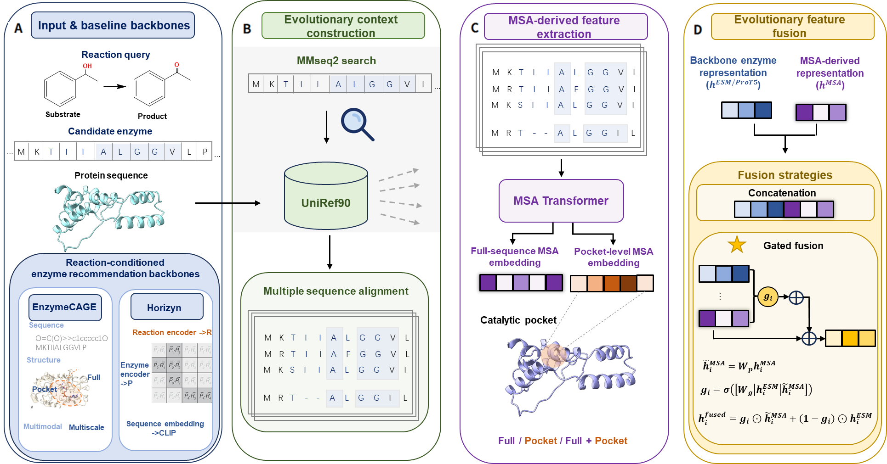

# ESR-evo

ESR-evo is an evolutionary augmentation framework for reaction-conditioned enzyme recommendation. It enriches candidate-enzyme representations with explicit evolutionary information derived from multiple sequence alignments (MSAs).



## Method

Candidate sequences are searched against UniRef90 with MMseqs2. The resulting MSAs are encoded with MSA Transformer to obtain residue-level evolutionary representations. Two complementary views are derived:

- **Full-sequence MSA features:** mean-pooled representations of global evolutionary constraints.
- **Pocket MSA features:** residue-level representations restricted to the predicted catalytic pocket.

These features augment two reaction-conditioned recommendation backbones, EnzymeCAGE and Horizyn. The implementations support individual evolutionary views and their joint use through learned gated fusion.

## MSA Feature Pipeline

The root-level scripts provide a shared MSA pipeline for both backbones:

```text
per-protein FASTA files
    -> seq2a3m.sh
per-protein A3M files
    -> run_msa_feature.py
full-sequence and pocket MSA Transformer features
```

### Environment

Use a dedicated environment because MSA Transformer is distributed by `fair-esm`, whereas the EnzymeCAGE feature environment uses the newer `esm` package.

```bash
conda create -n esr-msa python=3.10
conda activate esr-msa
conda install -c conda-forge -c bioconda mmseqs2
pip install torch fair-esm pandas numpy tqdm
```

Install the PyTorch build appropriate for the local CUDA version when GPU inference is required.

### 1. Generate A3M Files

Prepare one FASTA file per protein. Each filename stem must match the protein identifier in the embedding CSV:

```text
fasta1/
|-- P12345.fasta
|-- Q67890.fasta
`-- ...
```

Configure the variables at the top of `seq2a3m.sh`:

```bash
FASTA_DIR="fasta1"
OUT_DIR="msa1"
WORK_ROOT="work1"
UNIREF_DB="/path/to/uniref90_pad"

THREADS=6
MAX_SEQS=1000
BATCH=2000
USE_GPU=1
```

`USE_GPU=1` requires a GPU-enabled MMseqs2 binary and a GPU-compatible padded sequence database. Set `USE_GPU=0` for CPU search. `CUDA_VISIBLE_DEVICES` is preserved when supplied by a scheduler and otherwise defaults to device 1.

Run the batch:

```bash
bash seq2a3m.sh
```

The script writes `msa1/<protein_id>.a3m`, skips existing non-empty outputs, removes per-query temporary files, and stops after `BATCH` new A3M files have been written. Use separate `fastaX`, `msaX`, and `workX` directories for parallel jobs.

### 2. Extract MSA Transformer Features

The input CSV must contain `UniprotID` and `sequence` columns by default. Generate full-sequence features with:

```bash
python run_msa_feature.py \
  --input-csv data/proteins.csv \
  --msa-dir msa1 \
  --output-dir msa/features \
  --device cuda
```

To additionally extract pocket-residue features, provide a CSV containing `UniprotID` and `pocket_residues`. Residue indices must be one-based and may be comma-, semicolon-, or whitespace-separated.

```bash
python run_msa_feature.py \
  --input-csv data/proteins.csv \
  --msa-dir msa1 \
  --output-dir msa/features \
  --pocket-info data/pocket_info.csv \
  --device cuda
```

Custom schemas are supported through `--id-column`, `--sequence-column`, `--pocket-id-column`, and `--pocket-residues-column`. Existing residue NPZ files are reused unless `--overwrite` is specified.

The output layout is:

```text
msa/features/
|-- node_level/<protein_id>.npz
|-- protein_level/seq2feature.pkl
|-- pocket_node_feature/msa_node_feature.pt  # Created with --pocket-info
`-- summary.json
```

`seq2feature.pkl` maps full protein sequences to 768-dimensional mean-pooled representations. `msa_node_feature.pt` maps protein identifiers to residue-level pocket representations. These two files are shared by the EnzymeCAGE and Horizyn workflows.

## Evaluation

Experiments use two complementary benchmarks:

- **Enzyme-405:** generalization to novel enzymes.
- **Orphan-335:** enzyme retrieval for orphan reactions.

The repository contains the code and configurations for the three evolutionary variants used with each backbone: full-sequence MSA, pocket MSA, and their combination.

## Repository Structure

```text
ESR-evo/
|-- seq2a3m.sh          # UniRef90 search and A3M generation
|-- run_msa_feature.py  # MSA Transformer feature extraction
|-- ZENODO_DATA_DESCRIPTION.md  # Data archive inventory
|-- EnzymeCAGE-evo/     # EnzymeCAGE augmentation and experiments
|-- Horizyn-evo/        # Horizyn augmentation and experiments
`-- fig.png              # Framework overview
```

Reproduction instructions are provided for [EnzymeCAGE-evo](EnzymeCAGE-evo/README.md) and [Horizyn-evo](Horizyn-evo/README.md).

## License

Each backbone retains its original license; see the `LICENSE` file in the corresponding subdirectory.
